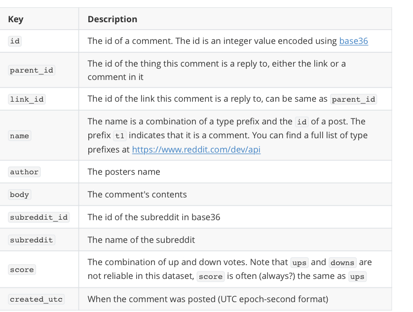

# Assignment 
## Task 1: Relational Algebra

```{SQL} 
<!-- Bei 1 - 5 muss jeweils noch die Schreibweise angepasst werden. Z.B bei 1 muss name nach unten gesetzt werden und die Bedninung für den Theta- Join muss unter das Symbol, steht hier jeweils in Klammern dahinter -->

1) 
SELECT name 
IN student JOIN enrolled
Where code = ‚2dv513‘  

result := 𝜋 name(student ⋈ (code = '2dv513') enrolledIn)

2)
SELECT name 
IN student JOIN enrolled
WHERE code = ‚2dv513‘ OR code = ‚1dv513‘

result := (𝜋 name(student ⋈ (code = '2dv513') enrolledIn)) ∪ (𝜋 name(student ⋈ (code = '1dv513') enrolledIn))

3) 
SELECT lecturer
IN subject
WHERE code = ‚2dv610‘

result := 𝜋 lecturer (𝜎 code = '2dv610'(subject))

4)
SELECT lecturer
IN subject
WHERE code = ‚2dv513‘ AND code =‚1dv513‘

result := (𝜋 lecturer (𝜎 code = '2dv610'(subject))) ∪ (𝜋 lecturer (𝜎 code = '1dv513'(subject)))

5)
SELECT name 
IN student JOIN enrolled JOIN subject
WHERE lecturer != ‚ILIR‘

``` 
$$ result := (𝜋 name(student ⋈ enrolledIn ⋈(lecturer != 'ilir') subject) $$

## Task 2: FDs and Normalization
1. *Functional Dependencies* 


**We have multiple FDs.**


		room time day -> manager 

		room time day -> applicant 
		
		--> room time day --> manager applicant 
		
     **or more?**		
  		manager day -> room
		
		manager applicant day -> room time
		
		room time day -> manager applicant
		
		applicant day -> room manager time 
1. *Find the Keys* 	

		Primary Key: room, time, day 


		Super Keys: 

		* room, time, day, applicant 
		* room, time, day, manager 
		* room, time, day, manager, applicant 

1. *Show the relations is in 3NF but not in BCNF*

 
        The manager and the applicant are independent from one another therefore the relation is in 3NF. 


<!--Beweis das es nicht in BCNF ist fehlt noch--> 
1. *Decompose the Relations that are in BCNF*
1. *Draw an E/R-Diagram that describes the System.*

## Task 3: Setting up the Reddit Database
###Schemas with types

* users(author)
* subreddits(subreddit, subreddit-id,)
* comments(id, name, body, score(ups , downs)<!--brauchen wir das?-->created_utc, link-id, parent-id)


### Notes
- The data is stored in Files
- The data is in Form of JSON FILES
- Each file contains a single month of Reddit posts

### JSON - Structure


### Keys



We can safely ignore keys not mentioned here.

## Task 5: Queries
```
1) function (NameOfUser){
	QUERY:
		SELECT SUM()
		IN COMMENTS
		WHERE user = NameOfUser
	}
2)
	function (subreddit) {
	QUERY:
		SELECT DURCHSCHNITT
		IN 
			SELECT GROUP(COMMENTS - DAY)
			IN Comments
			Where sub = subreddit
	}
3)
	function (Word) {
	QUERY:
		SELECT SUM
		IN
			SELECT *
			In Comments
			WHERE text INCLUDES Word
	}
4)
	function 
```


##Task 4: Importing data
##task 5: Queries
###1
####Query 
**select** count(id) **as** amount **from** Comments **where** user ='*USER*';
####Motivation
verwendet nur eine Tabelle 
###2
####Query
**Select** avg(allPerDay.Anzahl) 
**from**( 
	**Select** SUBREDDIT, **count**(WRITTEN_ON) as Anzahl 
	**FROM**(
		**SELECT** SUBREDDIT, 
		**round**((created / 60 / 60 / 24), 0) **as** WRITTEN_ON 
		**FROM** Reddit.Comments 
		**where** SUBREDDIT = '*SUB*'
		**ORDER by** WRITTEN_ON) 
	AS daylight" **group by** WRITTEN_ON)
**as** allPerDay;

####Motivation
nur eine Tabelle 
###3
####Query
**select** count(body) **as** amount **from** Comments **where** body **like** '%lol%';

####Motivation
nur eine tabelle
###4
####Query
**select** **distinct** Comments.SUBREDDIT 
**from** Comments **join**(
	**select** **distinct** Comments.USER 
	**from** Comments **join** Subreddits 
	**on** Subreddits.Name = Comments.SUBREDDIT 
	**where** linkID = '*Link*')
**as** test **on** Comments.USER = test.USER;
####Motivation
zwei 
###5
####Query
**Select** test.USER, test.Summe 
**from**(
	**Select** USER, **sum**(ups) **as** Summe 
	**from** Comments group by USER) **as** test 
	**join**(
		(**select** **max**(Summe) **as** Summe 
		**from** (
			**Select** USER, **sum**(ups) **as** Summe 
			**from** Comments **group by** USER)
		**as** Scores) 
	**union** (
		**select** **min**(Summe) **as** Summe 
		**from** (
			**Select** USER, **sum**(ups) **as** Summe 
			**from** Comments **group by** USER)
		**as** Scores))
**as** dumm **on** test.Summe = dumm.Summe;
####Motivation
nur eine tabelle	
###6
####Query
**Select** SUBREDDIT, ups **as** SCORE 
**from** Comments **where** ups 
**in** (
	**select** **MIN**(ups) 
	**from** Comments) 
**UNION** 
**Select** SUBREDDIT, ups 
**from** Comments **where** ups **in**(
	**select** **MAX**(ups) **from** Comments);
####Motivation
nur eine tabelle
###7 
####Query
**select** **distinct** USER 
**from** Reddit.Comments 
**where** linkID **in** (
	**select** linkID 
	**from** Reddit.Comments 
	**where** USER = '*USER*');
####Motivation
nur eine tabelle
###8
####Query
**select** USER 
**from** Comments 
**group by** USER **having** **count**(linkID) = 1;
####Motivation
nur eine tabelle 
###optional?

