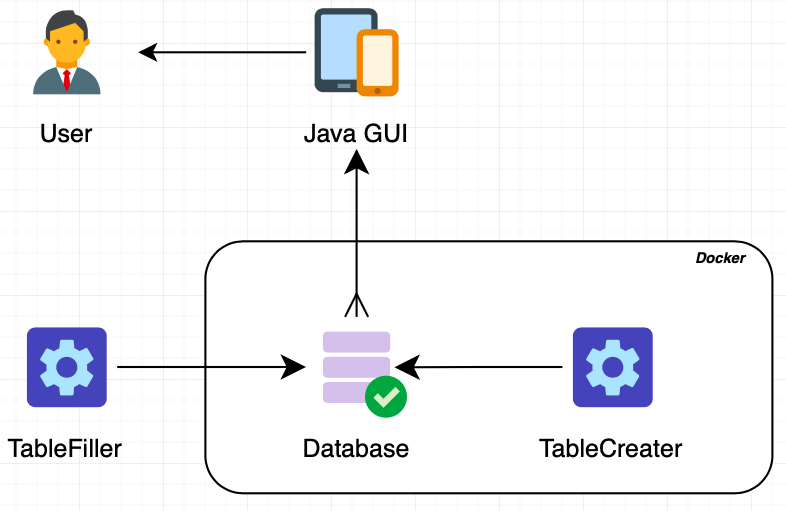
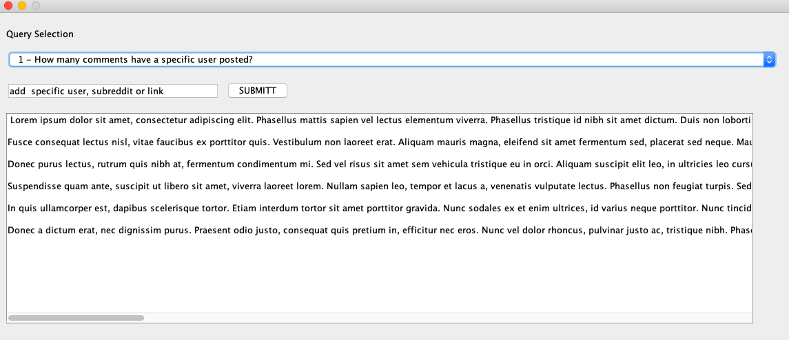
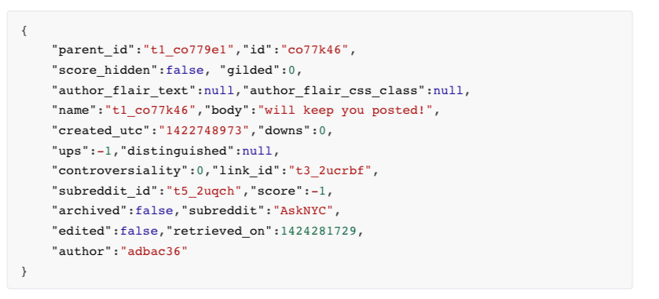
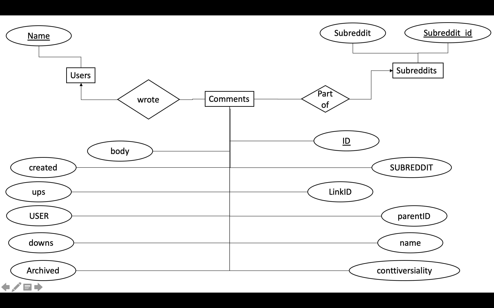
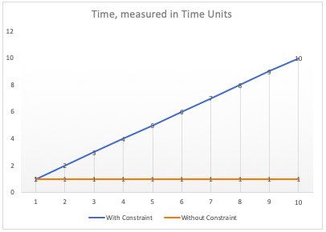

# Assignment 
## Task 1: Relational Algebra

<!-- Bei 1 - 5 muss jeweils noch die Schreibweise angepasst werden. Z.B bei 1 muss name nach unten gesetzt werden und die Bedninung für den Theta- Join muss unter das Symbol, steht hier jeweils in Klammern dahinter--> 

1) 

$$ result := 𝜋 name(student ⋈ (code = '2dv513') enrolledIn) $$


2)
$$ result := (𝜋 name(student ⋈ (code = '2dv513') enrolledIn)) ∪ (𝜋 name(student ⋈ (code = '1dv513') enrolledIn)) $$


1) 
$$ result := 𝜋 lecturer (𝜎 code = '2dv610'(subject))$$


4)
$$ result := (𝜋 lecturer (𝜎 code = '2dv610'(subject))) ∪ (𝜋 lecturer (𝜎 code = '1dv513'(subject))) $$


5)
$$ result := (𝜋 name(student ⋈ enrolledIn ⋈(lecturer != 'ilir') subject) $$


## Task 2: FDs and Normalization
1. *Functional Dependencies* 


**We have multiple FDs.**


		room time day -> manager 
	
		room time day -> applicant 
		
		--> room time day --> manager applicant 
		
	 **or more?**		
  		manager day -> room
		
		manager applicant day -> room time
		
		room time day -> manager applicant
		
		applicant day -> room manager time 
1. *Find the Keys* 	

		Primary Key: room, time, day 


		Super Keys: 
	
		* room, time, day, applicant 
		* room, time, day, manager 
		* room, time, day, manager, applicant 

1. *Show the relations is in 3NF but not in BCNF*


        The manager and the applicant are independent from one another therefore the relation is in 3NF. 


<!--Beweis das es nicht in BCNF ist fehlt noch--> 
1. *Decompose the Relations that are in BCNF*
1. *Draw an E/R-Diagram that describes the System.*


## Task 3: Setting up the Reddit Database


### The Structure

To build up our Database System (DB), we had to solve some specifications. 
Because we were working on to different Workstations, our Database had to be easy deployabal, so we could use it on different Systems.
The System should also be easy to modify and should build the ground Structures, such as tables by itself. We should also have no Problems with Networking connections.

Because of these Requirments, we came up with a Docker solution. 



Inside the Docker Cluster we have two Instances, the DB itself and a Python Script.
The Cluster itself is running inside a Network called *Assignment 1 DB*. 
The Database is a MYSQL-Database and has an attached volume wich is used to store the Data. 

The Scrip is called Tablecreater and creates the Tables. The image contains python 3.7 and the Script. The Script will try to connect to the DB and create the needed Tables. If this fails, the Script will wait for 60 seconds and then try again.

Another Python Script is called DB Filler which will take the Files, extract the Data and then transfer it into the needed Querys. It will then send these to the DB.
The originial Plan was to deploy another container called *DB_filler* with this script. We had to change Plans, because Containers have a size limit of 10 GB. We would have needed a container of roughly 25 GB. 
We then decided to run that container seperatly as a normal Python script, which takes some time, but works perfectly.

To Analyze the data, we have created a small Java Script, called Java Gui. The Gui can be used to create predesigned Querys that will be send to the Database.



### Docker-Compose 

The End Docker File looks like this:

```dockerfile
version: '0'

services:

  db:
    image: mysql:latest
    environment:
      MYSQL_DATABASE: Reddit
      MYSQL_ALLOW_EMPTY_PASSWORD: "yes"
      MYSQL_User: Python
      MYSQL_PASSWORD: Python
      MYSQL_HOST: '%'
      MYSQL_ROOT_HOST: '%'
    volumes:
      - db_data:/var/lib/mysql
    restart: always
    ports:
      - "3308:3306"

  Tablecreater:
    links:
      - "db:database"
    image: tablescreater:0.1


networks:
  main:
    name: Assignment 1 DB

volumes:
  db_data: {}
```

The Code and all aditional Things can be found on [Github](https://github.com/Darker97/Reddit-SQL-Databases)

### Internal Structure of the DB

After the DB was functioning properly, 
we had to use the JSON Structure to create our Schema.



We also had a List of keys.


The JSON Code was located  inside three Files, each containg all reddit posts of a single month.

We decided to create three Tables. 
We have named them Comments, Subreddits and users. 



The finished schema looked like this:

* Users(Name)
* Subreddits(Subreddit, Subreddit_id,)
* Comments(ID, name, body, ups, downs, created, linkID, parentID, Archived, conttiversiality, SUBREDDIT, USER)


##Task 4: Importing data
The question is whether it really saves time to turn on the constraints afterwards or if it takes even longer if the constraints are checked after they are turned on? 

In Theory, it should take less time to load the datasets, if you turn of the constraint, because the DBMS doesn't checl on every entry if that one is even allowed. 
We have calculated the difference in the following. 

To do so, we created a modell in which we load 10 Users into a Database. 
Because the time to run an SQL operation varies, we have used time units to measure it more correctly. For this calculation we assume that each operation needs one time Unit. Users only have one data field, which is why creating them only takes one time unit.




In the end, the method with activated constraints takes 55 time units, the method without constraints takes 10. But the resulting database is not yet the same for both methods. 

In the case with constraints, the Database is ready to be used, in the method without constraints it's not. The Rules we would like to add to the DB are not in place yet. If we activate them, it takes some time to redo the database. In our Modell, each user we check, has to be compared to 9 other Entrys. 

|Method|Input Time   |Extra Time|Total Time|
|---|---|---|---|
|with Constraint	|55   |0  |55 |
|without Constraint	|10   |90 |100|

We have calculated the worst case scenario, but we can see, that the total time of the method without constraint is way higher than the time with Constraint.

We therefore conclude that you should include your constraints before you load data into the database.

<!--Trenner:--------------------------------------------------:Trenner-->


##task 5: Queries

###1
####Query 
```
select count(id) as amount from Comments where user ='USER';
```
####Motivation
This Query is quite effective because it only has to analyze one table.


###2
####Query
```
Select avg(allPerDay.Anzahl) 
from( 
	Select SUBREDDIT, count(WRITTEN_ON) as Anzahl 
	FROM(
		SELECT SUBREDDIT, 
		round((created / 60 / 60 / 24), 0) as WRITTEN_ON 
		FROM Reddit.Comments 
		where SUBREDDIT = 'SUB'
		ORDER by WRITTEN_ON) 
	AS daylight group by WRITTEN_ON)
as allPerDay;
```
####Motivation
This Query is quite effective because it works by using only one table.


###3
####Query
```
select count(body) as amount from Comments where body like '%lol%';
```
####Motivation
This Query is quite effective because it works by using only one table.

###4
####Query
```
select distinct Comments.SUBREDDIT 
from Comments join(
	select distinct Comments.USER 
	from Comments join Subreddits 
	on Subreddits.Name = Comments.SUBREDDIT 
	where linkID = '*Link*')
as test on Comments.USER = test.USER;
```
####Motivation
zwei 

###5
####Query
```
Select test.USER, test.Summe 
from(
	Select USER, sum(ups) as Summe 
	from Comments group by USER) as test 
	join(
		(select max(Summe) as Summe 
		from (
			Select USER, sum(ups) as Summe 
			from Comments group by USER)
		as Scores) 
	union (
		select min(Summe) as Summe 
		from (
			Select USER, sum(ups) as Summe 
			from Comments group by USER)
		as Scores))
as dumm on test.Summe = dumm.Summe;
```
####Motivation
This Query is quite effective because it works by using only one table.


###6
For this query, we asume that we should only print out the Subreddit with the highest scored comment, and the Subreddit with the lowest scored comment.
####Query
```
Select SUBREDDIT, ups as SCORE 
from Comments where ups 
in (
	select MIN(ups) 
	from Comments) 
UNION 
Select SUBREDDIT, ups 
from Comments where ups in(
	select MAX(ups) from Comments);
```
####Motivation
This Query is quite effective because it works by using only one table.


###7 
####Query
```
select distinct USER 
from Reddit.Comments 
where linkID in (
	select linkID 
	from Reddit.Comments 
	where USER = 'USER');
```
####Motivation
This Query is quite effective because it works by using only one table.


###8
####Query
```
select USER 
from Comments 
group by USER having count(linkID) = 1;
```
####Motivation
This Query is quite effective because it works by using only one table.

###optional?

